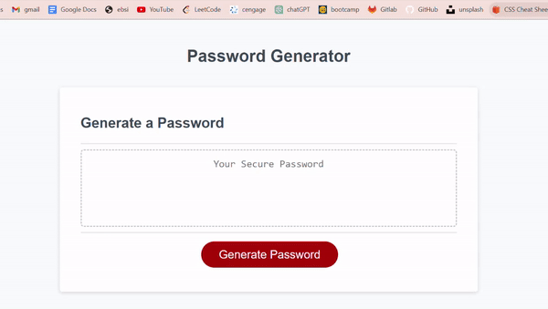

# Password Generator

## Technology Used
- html: Given from the challenge
- javascript: Partially given from the challenge
- css: Given from the challenge
- [ezgif](https://ezgif.com/): to convert a screen recording to gif file for demo listed here.

## Description 
This is a product of a challenge provided by UC Berkeley Extension Coding Bootcamp

This is a password generator that provides a randomly generated password for the user, as the user wants one or more of these requirements:
- Include lower case characters
- Include upper case characters
- Include numbers
- Include special characters

The user must provide the length of the password that meets following requirement:
- 8 or more length of characters
- less than 128 characters

[Deployed Wepsite](https://moonjunsain.github.io/password-generator/)

## Table of Contents

* [Installation](#installation)
* [Usage](#usage)
* [Credits](#credits)
* [License](#license)

## Installation

Simply follow the prompt box that window provides, and it will generate a password accordingly.

## Usage 

Following is the demo of this app.
The user can use keyboard to type in the length, also confirm by using keyboard or mouse.

## Credits

### June Moon
- Email: moonjunsain@gmail.com
- [Github](https://github.com/moonjunsain)
- [Linkedin](https://www.linkedin.com/in/june-moon-940538280/)

## License

MIT License

---

© 2023 edX Boot Camps LLC. Confidential and Proprietary. All Rights Reserved.